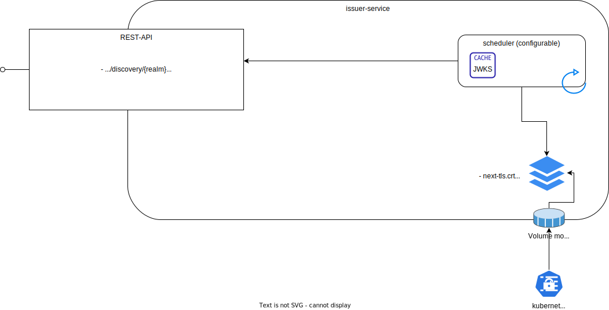

<!--
SPDX-FileCopyrightText: 2025 Deutsche Telekom AG

SPDX-License-Identifier: CC0-1.0    
-->

# Issuer-service

## About

Enables customers to validate Oauth2 tokens issued by related Gateway. Following endpoints are available:

* Token endpoint
* Discovery endpoint
* Certificate endpoint



## Code of Conduct

This project has adopted the [Contributor Covenant](https://www.contributor-covenant.org/) in version 2.1 as our code of
conduct. Please see the details in our [CODE_OF_CONDUCT.md](CODE_OF_CONDUCT.md). All contributors must abide by the code
of conduct.

By participating in this project, you agree to abide by its [Code of Conduct](./CODE_OF_CONDUCT.md) at all times.

## Licensing

This project follows the [REUSE standard for software licensing](https://reuse.software/).
Each file contains copyright and license information, and license texts can be found in the [./LICENSES](./LICENSES)
folder. For more information visit https://reuse.software/.

## Building

### Go build

Assuming you have already installed [Go](https://go.dev/), simply run the following to build the executable:

```bash
  go build ./...
```

### Docker build

The project contains a Dockerfile that can be used to build a Docker image. To build the image, run:

```bash
  docker build -t issuer-service:latest .
```

This will build the image and tag it as `issuer-service:latest`.

### Docker build (multi-stage)

Alternatively, you can use the multi-stage Docker build to build the image. To build the image, run:

```bash
  docker build -t issuer-service -f Dockerfile.multi-stage.dockerfile.multi-stage .
```

## Configuration

These are the environment variables that can be set to configure the application:

| Environment Variable | Description                            | Default Value         |
|----------------------|----------------------------------------|-----------------------|
| LOG_LEVEL            | Severity of the logging                | info                  |
| ISSUER_URL           | URL of the issuer                      | http://localhost:8080 |
| SERVER_PORT          | Port the application server listens on | 8080                  |
| API_BASE_PATH        | Base URL of the API                    | /api/v1               |

addtionally, you can/have to set the following JWKS environment variables:

| Environment Variable | Description                                                                                           | Default Value |
|----------------------|-------------------------------------------------------------------------------------------------------|---------------|
| CERT_UPDATE_INTERVAL | Interval in seconds in which the certificates should be updated. If 0 scheduler is deactivated at all | 10            |
| CERT_MOUNT_PATH      | Path to the directory where the certificates are mounted                                              |               |
| CERT_FILE_NEXT       | Name of the certificate file that should be used in the next rotation                                 | next-tls.crt  |
| KID_FILE_NEXT        | Name of the key ID file that should be used in the next rotation                                      | next-tls.kid  |
| CERT_FILE_ACTIVE     | Name of the certificate file that should be used currently                                            | tls.crt       |
| KID_FILE_ACTIVE      | Name of the key ID file that should be used currently                                                 | tls.kid       |
| CERT_FILE_PREV       | Name of the certificate file that was used in previously                                              | prev-tls.crt  |
| KID_FILE_PREV        | Name of the key ID file that that was used in previously                                              | prev-tls.kid  |

## Run

To be able to run the application, at least the environment variable CERT_MOUNT_PATH should be set correctly. The
defines directory should contain
the 6 files defines in the table above. The files should be mounted to the container.

```bash

## Token endpoint
Provides public key for given realm. Can be obtained from:

<em>Note: please be aware, that example is showing local endpoint, which will differ to exposed one!</em>

``curl -X GET \
http://${host}:${port}/api/v1/issuer/${realm}``

As a result, you should get a response as follows:

``
{
"realm": "default",
"public_key": "MIIBIjANBgkqhkiG9w0BAQEFAAOCAQ8AMIIBCgKCAQEA061GdxffIBvqgozjnCvkEd48++lh5ERUjSGLoAWCbp3Y4Lf7S3GiWN25+673Tfxb29LKe6evSl7yKT2b105JuwGokx2Geedw2BVkQhRZXpDbG5NV/4n3186SN77sEeuuuXW2QqrX9MmSGdX4CvZ6DjCOtRAA4cV/i+o77NLWpT7kx8YxWyMrAWJxxEOF1Y9suwz9d2hjOn2oeebf6GpbfaM4wJJdSgWeqyTzrF+Jr4rQeGP7gjAhrJWAEadQl0wUzwQoTIQlcUQ43Xo0N8KKP/Pj6r0fOwHQ7dKIXhnAiIV1L8boe+YkrW1ZRKVjAc3lNpKoFK1TQvDJRqnxG/E6aQIDAQAB"
}
``

## Certificate endpoint
Provides list of certificates. Correct one is matched based on key id ``kid`` from authorization token header. Can be obtained from:

``curl -X GET \
http://${host}:${port}/api/v1/certs/${realm}``

As a result, you should get a response as follows:

``
{
"keys": [
{
"kid": "6288e36f-b0d2-42c7-b739-1bd6c4ef0746",
"kty": "RSA",
"alg": "RS256",
"use": "sig",
"n": "061GdxffIBvqgozjnCvkEd48--lh5ERUjSGLoAWCbp3Y4Lf7S3GiWN25-673Tfxb29LKe6evSl7yKT2b105JuwGokx2Geedw2BVkQhRZXpDbG5NV_4n3186SN77sEeuuuXW2QqrX9MmSGdX4CvZ6DjCOtRAA4cV_i-o77NLWpT7kx8YxWyMrAWJxxEOF1Y9suwz9d2hjOn2oeebf6GpbfaM4wJJdSgWeqyTzrF-Jr4rQeGP7gjAhrJWAEadQl0wUzwQoTIQlcUQ43Xo0N8KKP_Pj6r0fOwHQ7dKIXhnAiIV1L8boe-YkrW1ZRKVjAc3lNpKoFK1TQvDJRqnxG_E6aQ",
"e": "AQAB",
"x5c": [
"MIIDITCCAgmgAwIBAgIUSpT62Euj58/ur9xX/B3fhboAEwEwDQYJKoZIhvcNAQELBQAwIDEeMBwGA1UEAwwVU3RhcmdhdGUudGVzdC5kZWZhdWx0MB4XDTIzMTEwOTE0MDA0NloXDTI2MDgwNTE0MDA0NlowIDEeMBwGA1UEAwwVU3RhcmdhdGUudGVzdC5kZWZhdWx0MIIBIjANBgkqhkiG9w0BAQEFAAOCAQ8AMIIBCgKCAQEA061GdxffIBvqgozjnCvkEd48++lh5ERUjSGLoAWCbp3Y4Lf7S3GiWN25+673Tfxb29LKe6evSl7yKT2b105JuwGokx2Geedw2BVkQhRZXpDbG5NV/4n3186SN77sEeuuuXW2QqrX9MmSGdX4CvZ6DjCOtRAA4cV/i+o77NLWpT7kx8YxWyMrAWJxxEOF1Y9suwz9d2hjOn2oeebf6GpbfaM4wJJdSgWeqyTzrF+Jr4rQeGP7gjAhrJWAEadQl0wUzwQoTIQlcUQ43Xo0N8KKP/Pj6r0fOwHQ7dKIXhnAiIV1L8boe+YkrW1ZRKVjAc3lNpKoFK1TQvDJRqnxG/E6aQIDAQABo1MwUTAdBgNVHQ4EFgQUQ/x0rBBxkjI5C2xWRag8B/uVKxswHwYDVR0jBBgwFoAUQ/x0rBBxkjI5C2xWRag8B/uVKxswDwYDVR0TAQH/BAUwAwEB/zANBgkqhkiG9w0BAQsFAAOCAQEAw8cyIHzoqEblBL8k0yue6b34YqriukC3JtnkB/WWcGWgMkLwVz0ZFP7yQkBoCqRd12On5SgFF+nyXNLpN05jj8L9q4W7o/3nli3s3U4fIXY408HTK5ujSehcORZBTFeghr16PAahZr68nCyzdU3/hisHgsOHY3MRKqHtleeKDKlvZ4dtWyM2TKKDff1FdRaThrgEIY/CJHTwVffe18LC8HE58PMIcqM8IsONuWOdDjLHdxcXdrLqr98dluXE7Lu3HPT2lOoZh/PP5a1WjADURI2s4czI2qQrZs+et68rtwb/q83WJdX3TA6Gw5XZoiyfhjyWNJ63U7pTI5eblXRwyQ=="
],
"x5t": "VK5ICOrx8xcyBDGpzxCbhIjib58",
"x5t#S256": "EMtOvNVQz_1YCfF9cj2WYz_ZgEbYQXvyHaXKJX5K3Hg"
}
]
}
``

## Discovery endpoint

Provides a discovery document from which clients can obtain all necessary information to interact with Issuer Service, including endpoint locations and capabilities.

The discovery document can be obtained from:

``curl -X GET \
http://${host}:${port}/api/v1/discovery/${realm}``

As a result, you should get a response as follows:

``
{
"issuer": "${host}:${port}/auth/realms/default",
"jwks_uri": "${host}:${port}/auth/realms/default/protocol/openid-connect/certs",
"authorization_endpoint": "${host}:${port}/auth/realms/default/protocol/openid-connect/auth",
"response_types_supported": [
"none"
],
"subject_types_supported": [
"public"
],
"id_token_signing_alg_values_supported": [
"RS256"
]
}
``

## Authorization endpoint
Not implemented on Issuer Service.
